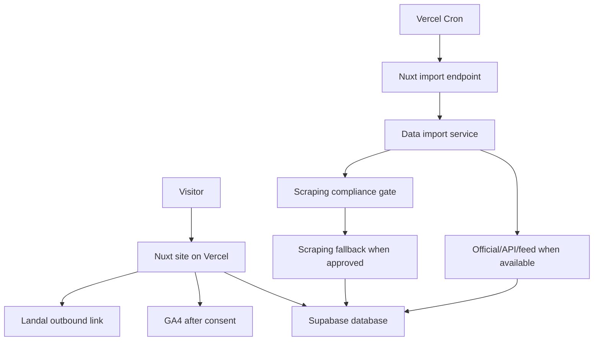

# Design: weekendjeweg MVP

Status: checkpoint-3-design-review
Created: 2026-05-19T11:25:00Z
Regenerated: 2026-05-19T11:55:00Z
Updated: 2026-05-19T12:10:00Z

## Design Goal

Design a production-ready Dutch Landal affiliate site using Nuxt, TypeScript, Supabase, and Vercel.

This design is generated from approved requirements in `requirements.md` and updated from guided design answers in `design-answers.md`.

## Decisions From Design Review Questions

- Route structure is approved: `/`, `/parken`, `/parken/[slug]`, `/regio/[slug]`.
- Existing Vue/Vite draft code must be removed entirely at the first construction step and rebuilt with Nuxt.
- Placeholder affiliate-link structure can be built before affiliate-network research is complete.
- Full tracking requires consent; anonymous functional click logs may be stored without cookie/user ID.
- First production version uses CSS/placeholder visuals; real images come later.
- Daily import recommendation: use Vercel Cron to call a Nuxt server endpoint because it is the simplest fit with Vercel + Supabase.
- First release supports Landal Netherlands only.
- Region SEO pages are route-supported but deferred; first release focuses on SEO-proof park pages.
- GA4 uses a simple consent banner; GA4 loads only after accepting.
- Search date UI uses arrival and departure date.
- Persons filter includes adults and children.
- Facilities are derived dynamically from Landal data.
- Scraping fallback is part of the first release if no API/feed exists, but a compliance gate is mandatory before any real scraper run.
- If API/feed and compliant scraping are impossible, the data/import work is blocked until data access is arranged.
- Frontend work may proceed with mock data while data access is unresolved; scraper/import construction remains blocked.

## Architecture Overview

## Runtime Components

### Nuxt Application

Responsibilities:

- Render home, park search, park detail, and route-supported region pages.
- Provide accessible search/filter interactions.
- Read park, facility, region, price, and affiliate link data from Supabase through server-side code.
- Generate SEO metadata and structured data.
- Track outbound clicks before redirecting to Landal.
- Respect consent before GA4 tracking.
- Use CSS/placeholder visuals in the first production version.

Recommended Nuxt areas:

- `app/pages/` or Nuxt pages for route-level pages.
- `app/components/` for reusable UI.
- `app/composables/` for reusable state and query helpers.
- `server/api/` for API endpoints such as click tracking, price/search access, and import triggers.
- `server/utils/` or equivalent for Supabase clients, affiliate URL building, and import helpers.
- `shared/types/` or `types/` for reusable TypeScript contracts.

### Supabase

Responsibilities:

- Store normalized Landal Netherlands park data.
- Store region and facility data.
- Store daily price snapshots.
- Store import runs and failures.
- Store outbound click events.
- Store anonymous functional click logs without cookie/user ID when cookies are rejected.
- Optionally store affiliate link templates and configuration.

### Daily Import

Recommended implementation:

1. Vercel Cron calls a protected Nuxt server endpoint once per day.
2. The endpoint starts the import service.
3. The import service tries official/API/feed access first.
4. If unavailable, it checks the scraping compliance gate.
5. Scraping runs only after robots.txt, terms, affiliate/network rules where available, and rate limits are approved.
6. The importer normalizes parks, regions, dynamically discovered facilities, and price snapshots.
7. Import status is recorded in Supabase.
8. If API/feed and compliant scraping are impossible, scraper/import construction is blocked until data access is arranged.

## Route Design

| Route | Purpose | First Release Status |
| --- | --- | --- |
| `/` | Home page | included |
| `/parken` | Park search with region, arrival/departure date, adults/children, and facility filters | included |
| `/parken/[slug]` | Park detail with price info and CTA to Landal | included |
| `/regio/[slug]` | Region landing page | route-supported but content/SEO deferred |

## Data Model Draft

### `regions`

- `id uuid primary key`
- `slug text unique not null`
- `name text not null`
- `country_code text not null`
- `seo_title text null`
- `seo_description text null`
- `created_at timestamptz not null`
- `updated_at timestamptz not null`

### `facilities`

- `id uuid primary key`
- `slug text unique not null`
- `name text not null`
- `source_key text null`

Facilities are populated dynamically from Landal data. The first release should not hardcode a fixed public facility list unless source data requires mapping.

### `parks`

- `id uuid primary key`
- `slug text unique not null`
- `name text not null`
- `location_name text not null`
- `region_id uuid references regions(id)`
- `country_code text not null default 'NL'`
- `description text null`
- `highlights jsonb not null default '[]'`
- `visual_placeholder_key text null`
- `source_url text not null`
- `landal_park_code text null`
- `last_imported_at timestamptz null`
- `created_at timestamptz not null`
- `updated_at timestamptz not null`

### `park_facilities`

- `park_id uuid references parks(id)`
- `facility_id uuid references facilities(id)`

### `price_snapshots`

- `id uuid primary key`
- `park_id uuid references parks(id)`
- `arrival_date date not null`
- `departure_date date not null`
- `adult_count integer not null`
- `child_count integer not null`
- `currency text not null`
- `price_amount numeric null`
- `price_label text null`
- `source_captured_at timestamptz not null`
- `expires_at timestamptz null`

### `affiliate_link_templates`

- `id uuid primary key`
- `park_id uuid references parks(id)`
- `base_url text not null`
- `tracking_template text null`
- `status text not null`
- `created_at timestamptz not null`
- `updated_at timestamptz not null`

### `outbound_clicks`

- `id uuid primary key`
- `park_id uuid references parks(id)`
- `destination_url_key text not null`
- `page_path text not null`
- `consent_state text not null`
- `tracking_scope text not null`
- `utm_context jsonb not null default '{}'`
- `clicked_at timestamptz not null`

`tracking_scope` values:

- `anonymous_functional`
- `full_consent`

### `import_runs`

- `id uuid primary key`
- `source_type text not null`
- `started_at timestamptz not null`
- `completed_at timestamptz null`
- `status text not null`
- `message text null`
- `records_imported integer not null default 0`

### `scraping_compliance_reviews`

- `id uuid primary key`
- `target_domain text not null`
- `robots_checked_at timestamptz null`
- `terms_checked_at timestamptz null`
- `rate_limit_policy text null`
- `approved_for_run boolean not null default false`
- `approved_at timestamptz null`
- `notes text null`

## Search and Filter Design

Inputs:

- Region.
- Arrival date.
- Departure date.
- Adults.
- Children.
- Facilities from dynamic Landal data.

Behavior:

- Region and facilities filter the park set.
- Arrival/departure dates and adults/children select the best matching price snapshot where available.
- The UI shows price only, never availability.
- Empty states include reset controls.
- Filter controls must be keyboard operable and screen-reader understandable.

## Price Design

Price display must include context:

- Arrival and departure date.
- Adults and children.
- Source freshness or fallback wording where useful.

No text may imply guaranteed availability unless a future approved data source supports that claim.

## Affiliate Link Design

Until the affiliate account is arranged:

- Store placeholder link templates.
- Build links in a way that can accept future tracking parameters.
- Label CTAs clearly, for example: `Bekijk bij Landal`.

When a visitor clicks:

1. Build destination URL.
2. Record an anonymous functional click log when consent is missing or rejected.
3. Record full tracking context only when consent allows it.
4. Continue to Landal even if non-blocking tracking fails, unless a future legal rule says otherwise.

## Consent and Analytics Design

- Use a simple consent banner.
- GA4 loads only after the visitor accepts analytics cookies.
- If the visitor rejects cookies, do not load GA4.
- Cookie rejection still allows anonymous functional outbound click logging without cookie/user ID.
- Consent banner must be keyboard accessible and screen-reader understandable.

## SEO Design

Required for first release:

- Home page metadata.
- Park search metadata.
- Park detail metadata.
- Park detail structured data only when accurate.
- Sitemap support.
- Robots behavior configured.
- No misleading availability structured data.

Deferred:

- Rich region SEO pages. The `/regio/[slug]` route can exist, but first-release SEO effort focuses on park pages.

## Accessibility Design

Required:

- Skip link.
- Semantic landmarks.
- Accessible names for filters, consent controls, and outbound CTAs.
- Visible focus states.
- Screenreader-friendly result counts and empty states.
- Reduced-motion friendly interaction.
- Lighthouse Accessibility 90+ target.

## Performance Design

- Prefer server-rendered or prerendered SEO pages where practical.
- Keep client JavaScript for search/filter interaction measured and purposeful.
- Use CSS/placeholder visuals initially to avoid external image performance uncertainty.
- Avoid loading GA4 before consent.

## Compliance Design

Before any real scraper run:

1. Check official/API/feed availability.
2. Check robots.txt.
3. Check terms.
4. Check affiliate/network rules when available.
5. Define rate limits.
6. Record approval in `scraping_compliance_reviews`.

Scraping may be implemented as a fallback, but it cannot run against real Landal data before the compliance gate passes.

## Existing Draft Code Decision

The existing Vue/Vite foundation does not match the approved Nuxt stack.

Decision:

- Remove the Vue/Vite draft entirely during the first construction step.
- Rebuild with Nuxt + TypeScript.
- Do not migrate or build additional functionality on top of the stale draft.

## Test Design

Unit/integration coverage:

- Data normalization.
- Search/filter query behavior.
- Price snapshot selection.
- Affiliate URL building.
- Consent-aware click tracking.
- Scraping compliance gate behavior.

E2E coverage:

- Home to search.
- Filter by region/arrival/departure/adults/children/facilities.
- Open park detail.
- CTA click path records outbound click and navigates to Landal or test double.
- Consent banner keyboard flow.

Quality gates:

- Typecheck.
- Unit tests.
- E2E critical path.
- Lighthouse 90+ for Performance, Accessibility, SEO on home, search, and representative detail page.

## Open Design Review Questions

1. Is this updated design approved for units/tasks generation?
2. Should the Vercel Cron import endpoint be protected by a shared secret, Vercel protection, or both?
3. Should mock data be used for frontend construction while Landal data access remains unresolved?

## Review Gate

Stop here for design review.

Do not generate units/tasks or continue construction until this design is approved or revised.
