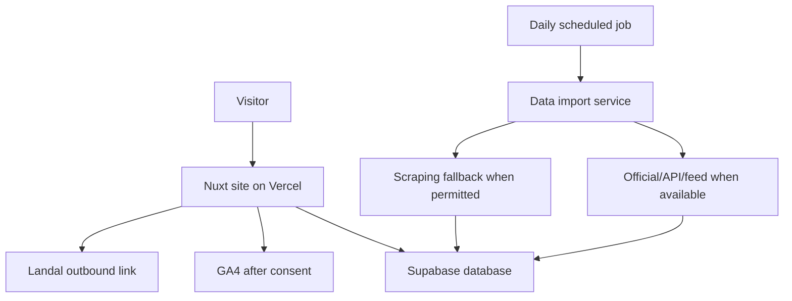

# Design: weekendjeweg MVP

Status: checkpoint-3-design-review
Created: 2026-05-19T11:25:00Z
Regenerated: 2026-05-19T11:55:00Z

## Design Goal

Design a production-ready Dutch Landal affiliate site using Nuxt, TypeScript, Supabase, and Vercel.

This design is generated from approved requirements in `requirements.md`. It replaces the earlier stale Vue/Vite design.

## Architecture Overview

## Runtime Components

### Nuxt Application

Responsibilities:

- Render home, park search, park detail, and SEO landing pages.
- Provide accessible search/filter interactions.
- Read park, facility, region, price, and affiliate link data from Supabase through server-side code.
- Generate SEO metadata and structured data.
- Track outbound clicks before redirecting to Landal.
- Respect consent before GA4 tracking.

Recommended Nuxt areas:

- `app/pages/` or Nuxt pages for route-level pages.
- `app/components/` for reusable UI.
- `app/composables/` for reusable state and query helpers.
- `server/api/` for API endpoints such as click tracking and price/search access.
- `server/tasks/` or equivalent scheduled import entrypoints depending on Vercel/Supabase cron approach.
- `shared/types/` or `types/` for reusable TypeScript contracts.

### Supabase

Responsibilities:

- Store normalized Landal park data.
- Store region and facility data.
- Store daily price snapshots.
- Store import runs and failures.
- Store outbound click events.
- Optionally store affiliate link templates and configuration.

### Daily Import

Responsibilities:

1. Discover official/API/feed option first.
2. If unavailable, run approved scraping fallback with rate limiting and compliance guardrails.
3. Normalize parks, regions, facilities, and price snapshots.
4. Preserve last known safe data when import fails.
5. Record import status in Supabase.

## Route Design

| Route | Purpose | Notes |
| --- | --- | --- |
| `/` | Home page | Dutch intro and entry to search |
| `/parken` | Park search | Region, date/period, persons, facilities filters |
| `/parken/[slug]` | Park detail | Price info, facilities, CTA to Landal |
| `/regio/[slug]` | Region landing page | SEO page when region data is available |

## Data Model Draft

### `regions`

- `id uuid primary key`
- `slug text unique not null`
- `name text not null`
- `country_code text not null`
- `seo_title text null`
- `seo_description text null`
- `created_at timestamptz not null`
- `updated_at timestamptz not null`

### `facilities`

- `id uuid primary key`
- `slug text unique not null`
- `name text not null`

### `parks`

- `id uuid primary key`
- `slug text unique not null`
- `name text not null`
- `location_name text not null`
- `region_id uuid references regions(id)`
- `country_code text not null`
- `description text null`
- `highlights jsonb not null default '[]'`
- `image_references jsonb not null default '[]'`
- `source_url text not null`
- `landal_park_code text null`
- `last_imported_at timestamptz null`
- `created_at timestamptz not null`
- `updated_at timestamptz not null`

### `park_facilities`

- `park_id uuid references parks(id)`
- `facility_id uuid references facilities(id)`

### `price_snapshots`

- `id uuid primary key`
- `park_id uuid references parks(id)`
- `start_date date not null`
- `end_date date not null`
- `guest_count integer not null`
- `currency text not null`
- `price_amount numeric null`
- `price_label text null`
- `source_captured_at timestamptz not null`
- `expires_at timestamptz null`

### `affiliate_link_templates`

- `id uuid primary key`
- `park_id uuid references parks(id)`
- `base_url text not null`
- `tracking_template text null`
- `status text not null`
- `created_at timestamptz not null`
- `updated_at timestamptz not null`

### `outbound_clicks`

- `id uuid primary key`
- `park_id uuid references parks(id)`
- `destination_url_key text not null`
- `page_path text not null`
- `consent_state text not null`
- `utm_context jsonb not null default '{}'`
- `clicked_at timestamptz not null`

### `import_runs`

- `id uuid primary key`
- `source_type text not null`
- `started_at timestamptz not null`
- `completed_at timestamptz null`
- `status text not null`
- `message text null`
- `records_imported integer not null default 0`

## Search and Filter Design

Inputs:

- Region.
- Date/period.
- Number of persons.
- Facilities.

Behavior:

- Region and facilities filter the park set.
- Date/period and number of persons select the best matching price snapshot where available.
- The UI shows price only, never availability.
- Empty states include reset controls.
- Filter controls must be keyboard operable and screen-reader understandable.

## Price Design

Price display must include context:

- Selected period.
- Number of persons.
- Source freshness or fallback wording where useful.

No text may imply guaranteed availability unless a future approved data source supports that claim.

## Affiliate Link Design

Until the affiliate account is arranged:

- Store placeholder link templates.
- Build links in a way that can accept future tracking parameters.
- Label CTAs clearly, for example: `Bekijk bij Landal`.

When a visitor clicks:

1. Build destination URL.
2. Attempt to record outbound click in Supabase.
3. Continue to Landal even if non-blocking tracking fails, unless consent/legal design later says otherwise.

## Consent and Analytics Design

- GA4 loads only according to the chosen consent mode.
- Consent banner must be keyboard accessible.
- Consent state is included in outbound click records.
- Tracking must not break the affiliate CTA flow.

## SEO Design

Required:

- Page-specific title and description.
- Park detail structured data only when accurate.
- Region pages generated from region data where enough content exists.
- Sitemap support.
- Robots behavior configured.
- No misleading availability structured data.

## Accessibility Design

Required:

- Skip link.
- Semantic landmarks.
- Accessible names for filters, consent controls, and outbound CTAs.
- Visible focus states.
- Screenreader-friendly result counts and empty states.
- Reduced-motion friendly interaction.
- Lighthouse Accessibility 90+ target.

## Performance Design

- Prefer server-rendered or prerendered SEO pages where practical.
- Keep client JavaScript for search/filter interaction measured and purposeful.
- Use image optimization strategy once image source is decided.
- Avoid blocking third-party scripts before consent.

## Compliance Design

Before implementing scraping:

1. Check official/API/feed availability.
2. Check robots.txt and terms.
3. Check affiliate/network rules when available.
4. Define rate limits.
5. Log import runs and failures.

Scraping must remain a fallback, not the default assumption.

## Existing Draft Code Decision

The existing Vue/Vite foundation does not match the approved Nuxt stack.

Design recommendation:

- Remove or replace the Vue/Vite draft during the first construction planning step.
- Do not build additional functionality on top of that draft.

## Test Design

Unit/integration coverage:

- Data normalization.
- Search/filter query behavior.
- Price snapshot selection.
- Affiliate URL building.
- Consent-aware click tracking.

E2E coverage:

- Home to search.
- Filter by region/date/persons/facilities.
- Open park detail.
- CTA click path records outbound click and navigates to Landal or test double.
- Consent banner keyboard flow.

Quality gates:

- Typecheck.
- Unit tests.
- E2E critical path.
- Lighthouse 90+ for Performance, Accessibility, SEO on home, search, and representative detail page.

## Open Design Review Questions

1. Is the route set `/`, `/parken`, `/parken/[slug]`, `/regio/[slug]` approved?
2. Should the first construction step remove the stale Vue/Vite draft entirely?
3. Should affiliate-network research be a separate first bolt before Nuxt implementation?
4. Should outbound click tracking require consent before storing any event, or store limited functional click logs regardless of GA4 consent?
5. Should image handling wait until data-source discovery, or should placeholders be designed now?

## Review Gate

Stop here for design review.

Do not generate units/tasks or continue construction until this design is approved or revised.
